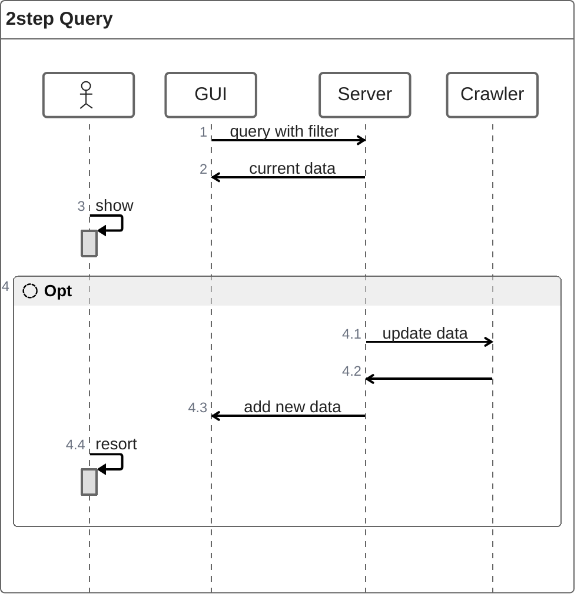

# PickNBuy

Implement a tool in python. It contains 5 parts. 

Part 1 is a crawler for web sides.  

Part 2 is a Cache it stores the received pages.  Create a method for cache that calls checks if cache file exists. 
If no cache file for page is available reads crawl and stores the result in caching file.

Part 3 is the extractor it extracts items from HTML DOM-Structure by DIV-Elements into assoziative array. 
Part 3 is a web interface. It offers Input-Elements for Page to crawl and filters to apply. 
As a result, it will list the items from the assoziative array.  It uses grid layout and lightweight style. 
Content is retrieved via lazy-loading. Scrolling down retrieves further content. 
Define an HTML with javascript to handle that. 

Part 4 is the coordinator it is started by the web interface and uses Part 1 to receive pages and follows the 
next-page link.

 - Ordering in Frontend - as we do not want to reload just for re-ordering ...
 - m

 - x 

# Architecture

usage GUI

Caching in every step. Allow fast and quiet adjusting w/o re-requesting data.

wordCount [ a-word ]

words [ < a-word > ] = [ key1, key2 ... ]

data [ key ] = [ key, val1 , val2 ,... ]

dupl - do not add same key multiple times to word

